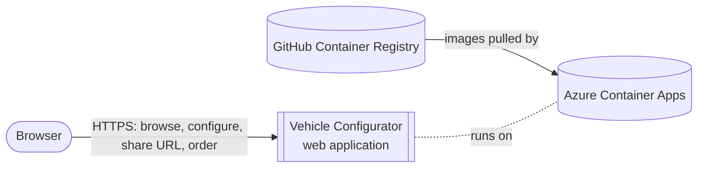
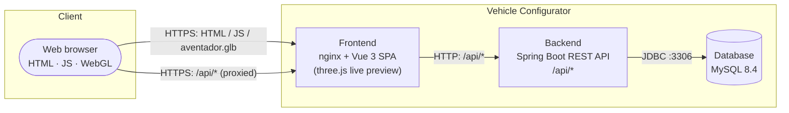
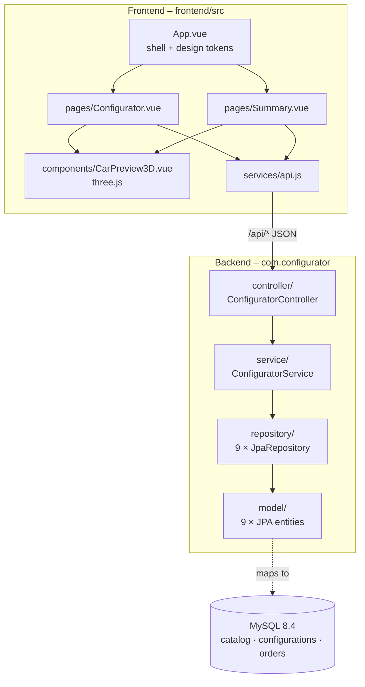
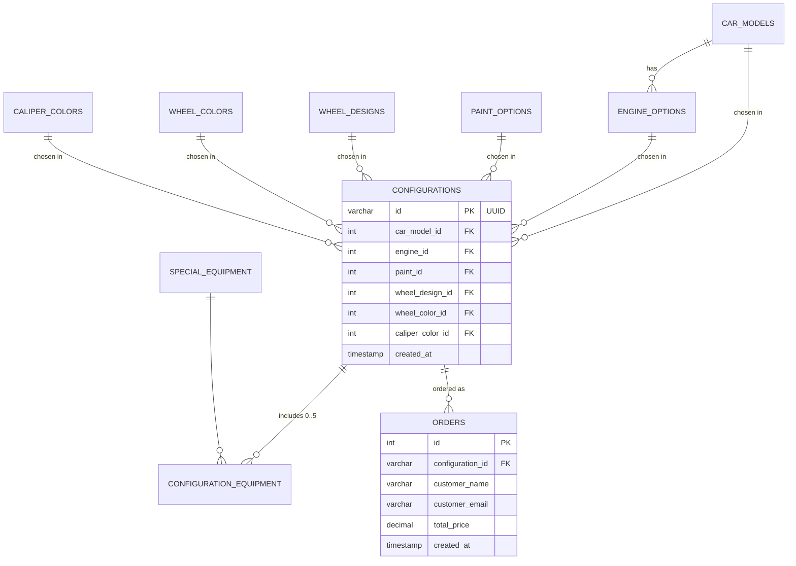
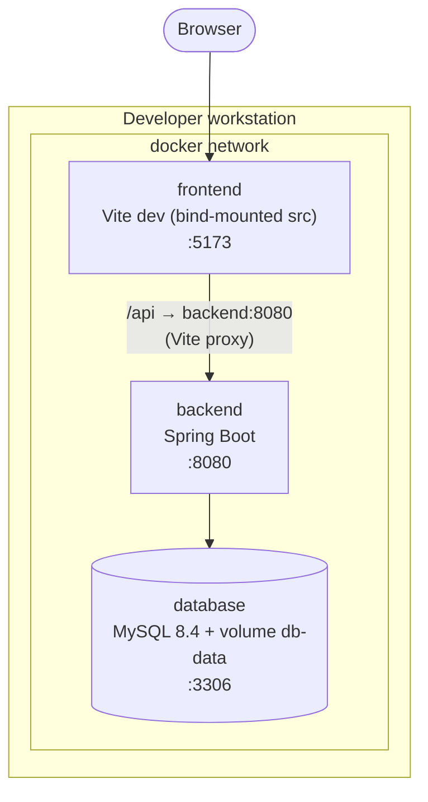
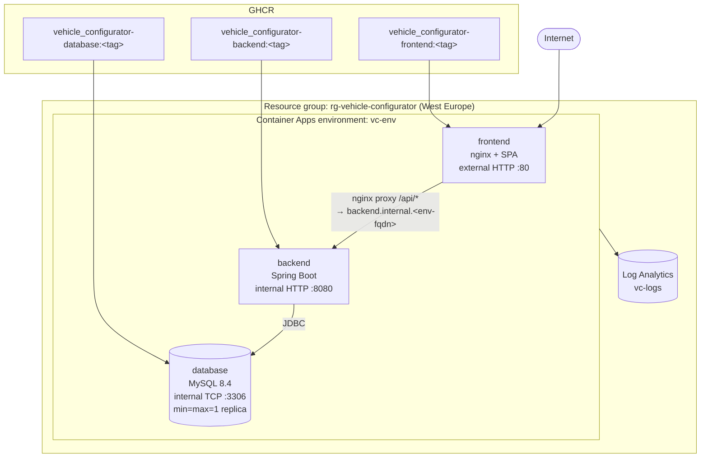
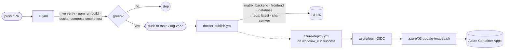

# Architecture Overview

A short, diagram-first overview of the **Vehicle Configurator**
prototype. For the full description (quality goals, ADRs, runtime
scenarios, risks, glossary, …) see [`docs/arc42/`](docs/arc42/README.md).

## At a glance

- **Style:** classic 3-tier — SPA frontend, stateless REST backend,
  relational database.
- **Frontend:** Vue 3 + Vite, with a live three.js 3D car preview.
- **Backend:** Spring Boot 4 on Java 25 (virtual threads), JPA/Hibernate.
- **Database:** MySQL 8.4, schema managed by an init SQL script
  (Hibernate runs with `ddl-auto=none`).
- **Packaging:** everything containerized; same images in dev and cloud.
- **Cloud:** Azure Container Apps in West Europe, deployed via GitHub
  Actions + OIDC federation.

## System context

The only human actor is the end user (prospective buyer). No external
business systems (no payment gateway, no CRM, no auth provider) are
integrated in the prototype.

## Component diagram (containers)

Three runtime containers cooperate. Only the frontend is exposed to
the internet; the backend and database have internal ingress only.

## Component diagram (internal modules)

### Key responsibilities

| Module | Responsibility |
|--------|----------------|
| `App.vue` | Sticky header with `#header-actions` teleport target; defines all CSS design tokens. |
| `Configurator.vue` | Multi-step configurator, reactive running total, calls `saveConfiguration()` and navigates to `/summary/:id`. |
| `Summary.vue` | Renders a persisted configuration + order form; "Back" button teleported into the header. |
| `CarPreview3D.vue` | three.js scene; loads `aventador.glb` once, mutates body / wheel / caliper material colors and toggles rim meshes reactively on prop changes. |
| `services/api.js` | Thin `fetch` wrapper for `/api/options`, `/api/car-models/:id/engines`, `/api/configurations`, `/api/orders`. |
| `ConfiguratorController` | REST surface under `/api`; class-level `@CrossOrigin(origins="*")` for dev convenience. |
| `ConfiguratorService` | Assembles configurations, generates their UUID, computes `calculateTotalPrice`, creates orders (`@Transactional`). |
| `repository/*` | One Spring Data JPA interface per entity – no custom queries. |
| `model/*` | JPA entities mapped to the tables in `database/init/001-init.sql`. |

## Data model (core)

`Configuration.id` is a server-generated UUID so that
`/summary/<uuid>` is safe to share publicly. DDL and seed data live in
[`database/init/001-init.sql`](database/init/001-init.sql).

## Deployment – local (Docker Compose)

One-command start: `cd docker && docker compose up --build`.
A second compose file (`docker/compose.prod.yml`) pulls the
GHCR images – same three containers, nginx serves the SPA in the
frontend, exactly as in the cloud.

## Deployment – cloud (Azure Container Apps)

| Component | Ingress | Scaling |
|-----------|---------|---------|
| `frontend` | **external** HTTP :80 | 0 ↔ 2 replicas |
| `backend` | **internal** HTTP :8080 | 0 ↔ 2 replicas |
| `database` | **internal** TCP :3306 | 1 replica pinned (stateful) |

Provisioning is driven from the laptop via idempotent shell scripts in
[`azure/`](azure/):

- `00-bootstrap-oidc.sh` – creates the AAD app, federated credential
  (`repo:fbrase-itk/vehicle_configurator:ref:refs/heads/main`), and
  pushes the required GitHub secrets. One-off.
- `01-setup.sh` – ensures RG, Log Analytics, env, and all three
  container apps (idempotent).
- `02-update-images.sh` – `az containerapp update --image … --revision-suffix` for all three apps; used locally and by CI.
- `03-teardown.sh` – prompts for confirmation, then `az group delete`.

## CI/CD pipeline

- `ci.yml` – Java 25 backend build, Node 22 frontend build, and a
  full smoke test that spins up `database + backend` via Compose and
  exercises every REST endpoint (including `POST /api/configurations`
  → `GET /api/configurations/{id}` → `POST /api/orders`).
- `docker-publish.yml` – matrix build for all three images, pushed to
  `ghcr.io/fbrase-itk/vehicle_configurator-<component>` with `latest`,
  short SHA, branch, and semver tags.
- `azure-deploy.yml` – triggered on a successful `docker-publish`
  run on `main`; logs into Azure via OIDC (no long-lived secrets) and
  runs `azure/02-update-images.sh`.

## Key design choices (one-liners)

- **Aggregated `/api/options`** – one round-trip loads the whole
  catalog; property changes never hit the network.
- **Server-computed prices** – `ConfiguratorService.calculateTotalPrice`
  is the authoritative total (persisted into `orders.total_price`).
  The client's running total is advisory.
- **3D preview mutates in place** – paint / wheel / caliper changes
  update material colors or toggle rim meshes; the scene is never
  rebuilt.
- **Schema in SQL** – `database/init/001-init.sql` is the source of
  truth; Hibernate does not manage DDL.
- **Single theming point** – all colors / gradients are CSS custom
  properties in `frontend/src/App.vue` `:root`; rebranding is a
  one-file change.
- **OIDC-only cloud access** – no Azure secrets in the repo; only
  non-secret tenant / client / subscription IDs.

## Where to go next

- Detailed architecture, including ADRs, runtime sequence diagrams,
  quality scenarios and risks → [`docs/arc42/`](docs/arc42/README.md).
- Runtime API surface → [`README.md`](README.md#api-endpoints).
- Theme tokens → [`README.md`](README.md#theme--design-tokens).
- Local run → [`README.md`](README.md#quick-start).
