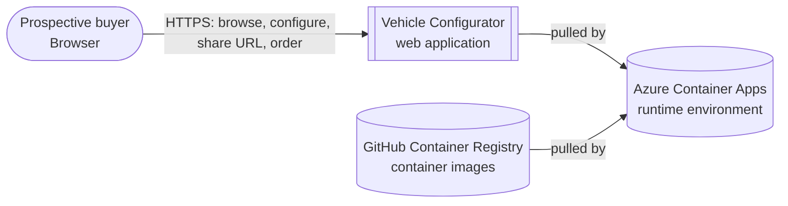
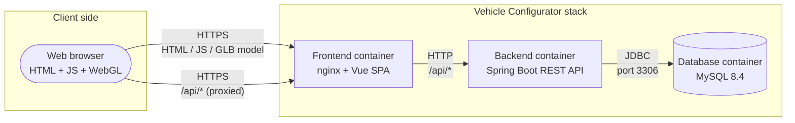

# 3. System Scope and Context

## 3.1 Business Context

| Neighbour | Direction | Purpose |
|-----------|-----------|---------|
| **End user (browser)** | inbound | Browses the catalog, configures a car, receives a shareable URL, submits an order. The only human actor. |
| **GitHub / GHCR** | build time | Source of truth for code and container images. CI pushes images, CD pulls them. |
| **Azure Container Apps** | runtime | Managed runtime hosting the three containers. The application itself has no direct dependency on Azure APIs. |

No third-party business systems are integrated in the prototype
(no payment gateway, no CRM, no dealer back-office).

## 3.2 Technical Context

The system is a three-tier web application. All internal traffic flows
over HTTP/JDBC within a private network; only the frontend is exposed to
the internet.

### External interfaces

| # | Channel | Endpoint | Protocol | Payload | Notes |
|---|---------|----------|----------|---------|-------|
| I1 | Browser ↔ Frontend | `https://<fe-fqdn>/` | HTTPS | HTML, JS, CSS, `aventador.glb` (3D model) | Static assets served by nginx in prod, Vite dev server locally. |
| I2 | Browser ↔ Backend (via proxy) | `https://<fe-fqdn>/api/*` | HTTPS → HTTP | JSON | nginx location block `proxy_pass http://${BACKEND_UPSTREAM}` forwards to the backend container. |
| I3 | Backend ↔ Database | `database:3306` | JDBC (MySQL) | SQL | Credentials injected as env vars; database is reachable only inside the ACA environment. |

### Channel summary for the REST API

The full surface is listed in README.md; for context-level purposes:

- `GET /api/options` – full catalog bootstrap (one round-trip).
- `GET /api/car-models/{id}/engines` – dependent list.
- `POST /api/configurations` → returns a UUID used in the shareable URL.
- `GET /api/configurations/{id}` – used by the summary page and by the
  shared URL.
- `POST /api/orders` – final submission.

Everything else (paints, wheels, calipers, equipment) is idempotent
`GET` and cacheable.

## 3.3 What is NOT part of the system

- User accounts, passwords, roles.
- Payment processing; "submit order" just persists name + email.
- Production-grade database (managed MySQL, backups, HA).
- Email / notification delivery.
- Multi-language / multi-currency logic (prices in EUR only).
- Stock / availability checks.
