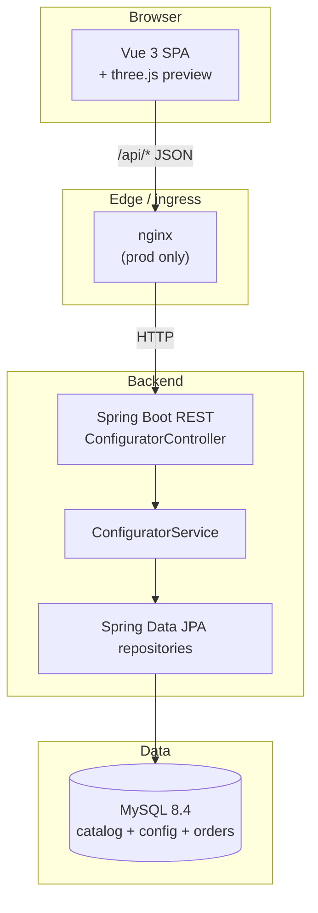

# 4. Solution Strategy

This section captures the handful of fundamental decisions from which
everything else in the architecture follows. Detailed rationale per
decision is in [09 – Architecture Decisions](09-architecture-decisions.md).

## 4.1 Fundamental Decisions

| Area | Decision | Why |
|------|----------|-----|
| **Architectural style** | Classic 3-tier: SPA frontend, stateless REST backend, relational database. | Matches the PRD constraints and is the lowest-risk option for a prototype. Enables independent scaling, containerization, and a clean public/private split at the ingress. |
| **Frontend framework** | Vue 3 + Vite + Vue Router, no store library. | PRD allows Vue/React/Angular; Vue 3's composition/reactivity covers the app's state needs without pulling in Redux/Pinia for a two-page flow. |
| **Live 3D preview** | three.js with a GLTF model and a single scene that mutates materials reactively on Vue prop changes. | Gives the "premium configurator" feel required by Quality Goal 1 without building a render engine ourselves. Materials are updated in place – no scene rebuild on paint/caliper change. |
| **Backend framework** | Spring Boot 4.0 on Java 25, packaged as a single fat-jar. | Standard Java-on-the-JVM choice; minimal starters only (web, data-jpa, validation). Virtual threads enabled for lightweight concurrency. |
| **Persistence** | JPA/Hibernate on MySQL 8.4; schema managed **outside** of Hibernate via `database/init/001-init.sql`. | DDL versioned with the code, reviewable as SQL, reproducible on every fresh container. Hibernate only maps, never migrates. |
| **Configuration identity** | Configuration IDs are **UUIDs** generated by the backend (not MySQL auto-increment). | Required for the shareable URL (`/summary/<uuid>`) – non-guessable and safe to paste publicly. |
| **API contract** | Coarse-grained `GET /api/options` returns the full catalog in a single call; fine-grained endpoints exist per resource for completeness. | Keeps the initial render fast (one request to fill the configurator) while still allowing selective re-fetch (e.g. `engines-for-model`). |
| **Containerization** | Every process runs in a container, both locally and in the cloud; the *same* images used in prod are available locally via `compose.prod.yml`. | Parity between dev and prod; removes "works on my machine" drift. |
| **Cloud target** | Azure Container Apps in West Europe; MySQL runs as a Container App (single pinned replica). | Serverless scale-to-zero for backend + frontend, minimal fixed cost. Managed MySQL deliberately avoided for the prototype (cost + setup effort). |
| **CI/CD** | GitHub Actions only: `ci.yml` for tests, `docker-publish.yml` for image build, `azure-deploy.yml` for `az containerapp update`. | Single provider, OIDC to Azure (no long-lived secrets), scripts re-usable from a developer's laptop. |
| **Theming** | All colors and gradients are CSS custom properties in one `:root` block (`App.vue`); components reference them via `var(--token)`. | Rebranding is a one-file change. Decouples visual identity from component code. |

## 4.2 Key Quality-Driven Tactics

- **Instant feedback (Quality Goal 1)** – the configurator keeps the
  full option catalog and the full price table in memory after the
  initial load. Price is a pure computation over the selected IDs;
  rendering is a direct Vue reactivity chain.
- **Deployability (Quality Goal 2)** – three things are identical across
  dev and prod: the database schema (same SQL init script), the backend
  image, and the frontend proxy path (`/api/*`). The nginx `BACKEND_UPSTREAM`
  env var is the only thing that changes between laptop (`backend:8080`)
  and Azure (`backend.internal.<envDefaultDomain>`).
- **Evolvability (Quality Goal 3)** – each option category is its own
  entity + repository; adding a new one follows a single, repeatable
  recipe (see ADR-005 in section 9).

## 4.3 Architecture Overview (bird's-eye)

