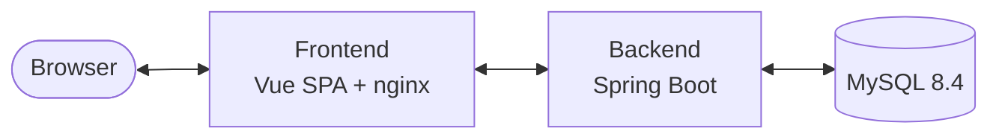
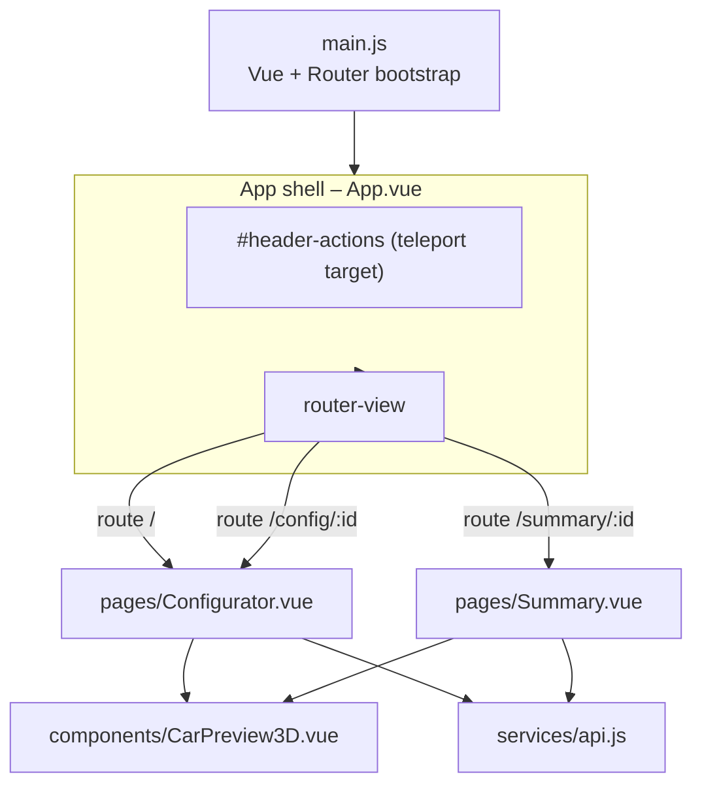
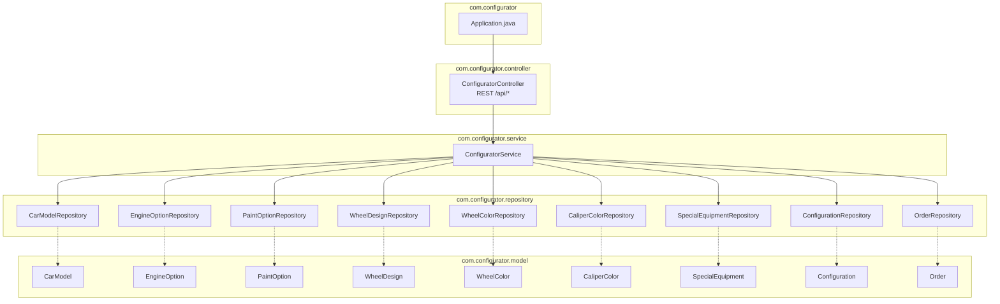
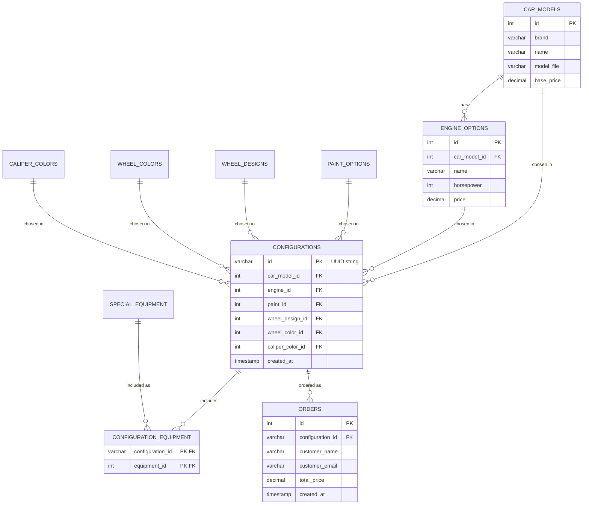

# 5. Building Block View

The building block view is the static decomposition of the system into
cooperating black boxes, progressively refined level by level.

## 5.1 Whitebox – Level 1 (System)

| Building block | Responsibility |
|----------------|----------------|
| **Frontend** | Serves static assets, proxies `/api/*` to the backend, provides the interactive configurator and summary UIs including the 3D preview. |
| **Backend** | Stateless REST API; reads the catalog, validates and persists configurations and orders, computes totals. |
| **Database** | Stores the option catalog (seeded on first start), configurations, and orders. |

## 5.2 Whitebox – Level 2

### 5.2.1 Frontend (whitebox)

| Component | Location | Responsibility |
|-----------|----------|----------------|
| `main.js` | `frontend/src/main.js` | Creates the Vue app, registers the three routes (`/`, `/config/:id`, `/summary/:id`), mounts `App.vue`. |
| `App.vue` | `frontend/src/App.vue` | App shell: sticky dark header, `#header-actions` slot for pages to inject controls via `<Teleport>`, `<router-view/>` for the current page. Defines all design tokens (CSS custom properties). |
| `Configurator.vue` | `frontend/src/pages/Configurator.vue` | Multi-step configurator. Holds the selection state, fetches options, computes the running total, teleports step-navigation + CTA into the header, saves and navigates to `/summary/<uuid>`. |
| `Summary.vue` | `frontend/src/pages/Summary.vue` | Loads a persisted configuration by id, renders the 3D preview + detail table + total, exposes "Back" (teleported to header) and the order form. |
| `CarPreview3D.vue` | `frontend/src/components/CarPreview3D.vue` | Self-contained three.js canvas. Loads `aventador.glb` (+ DRACO + HDR environment), then reactively mutates body paint, wheel color, caliper color and toggles between two rim meshes. |
| `CarPreview.vue` | `frontend/src/components/CarPreview.vue` | Legacy 2D SVG preview (kept in-tree; not referenced by the active pages). |
| `services/api.js` | `frontend/src/services/api.js` | Thin `fetch` wrapper against `/api`. Exposes `fetchOptions`, `fetchEnginesForModel`, `saveConfiguration`, `getConfiguration`, `createOrder`. |

### 5.2.2 Backend (whitebox)

| Package | Responsibility |
|---------|----------------|
| `com.configurator` | `Application.java` – Spring Boot entry point. |
| `com.configurator.controller` | HTTP boundary. `ConfiguratorController` exposes `/api/options`, the catalog endpoints (`/api/car-models`, `/api/engines`, `/api/paints`, `/api/wheel-designs`, `/api/wheel-colors`, `/api/caliper-colors`, `/api/equipment`), `POST /api/configurations`, `GET /api/configurations/{id}`, and `POST /api/orders`. Class-level `@CrossOrigin(origins = "*")`. |
| `com.configurator.service` | `ConfiguratorService` – the single place where business logic lives: aggregates the catalog for `/api/options`, validates and assembles a `Configuration` from an incoming `ConfigurationRequest`, generates the UUID, creates an `Order` from an `OrderRequest`, computes `calculateTotalPrice()`. |
| `com.configurator.repository` | One Spring Data JPA interface per entity, all `extends JpaRepository<E, ID>`. No custom queries – method names and `findBy…` suffice. |
| `com.configurator.model` | JPA entities mapped to the tables defined in `database/init/001-init.sql`. Catalog entities have `Integer` PKs (`IDENTITY`); `Configuration` has a `String` (UUID) PK; `Order` has an `Integer` PK and `@ManyToOne Configuration`. `Configuration ↔ SpecialEquipment` is `@ManyToMany` via the `configuration_equipment` join table. |

### 5.2.3 Database (whitebox)

Schema overview (see `database/init/001-init.sql` for the authoritative
DDL):

Tables `PAINT_OPTIONS`, `WHEEL_DESIGNS`, `WHEEL_COLORS`, `CALIPER_COLORS`,
and `SPECIAL_EQUIPMENT` are catalog-only tables with `id`, `name`, a
discriminator column (`color_code` or `model_object`), and `price`.
Initial seed data is inserted by the same init script on first container
start.
