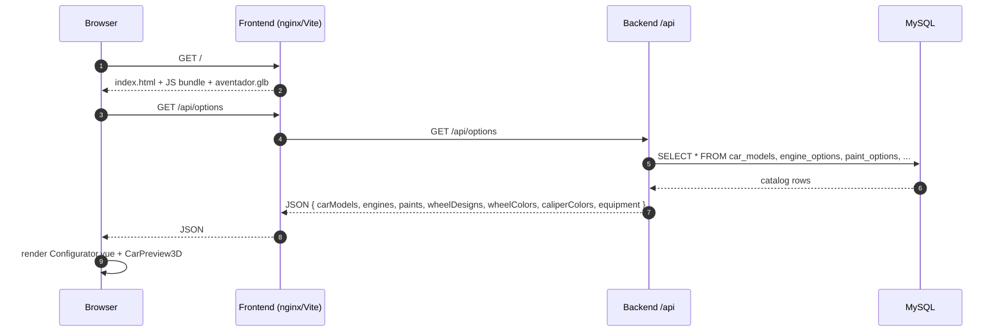
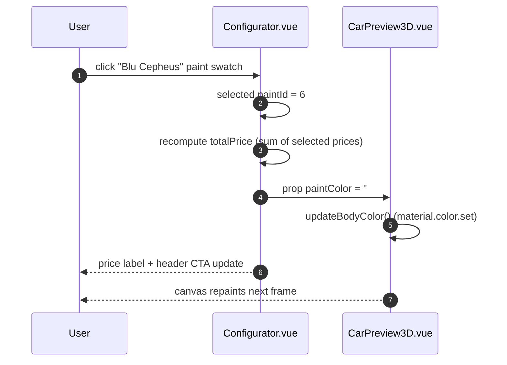
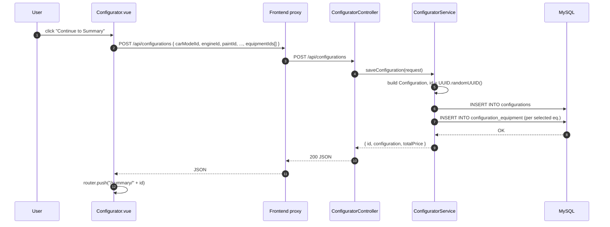
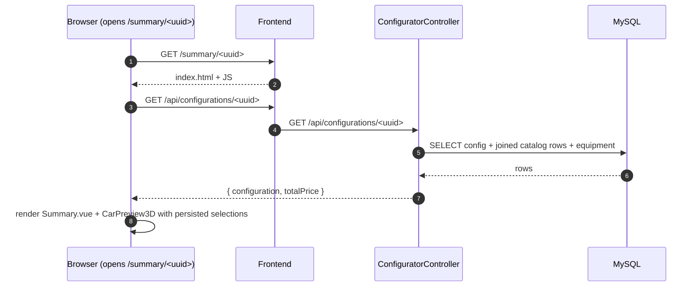
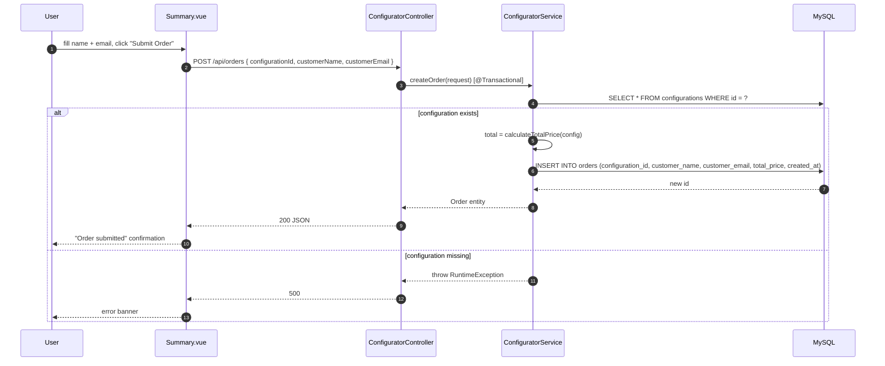
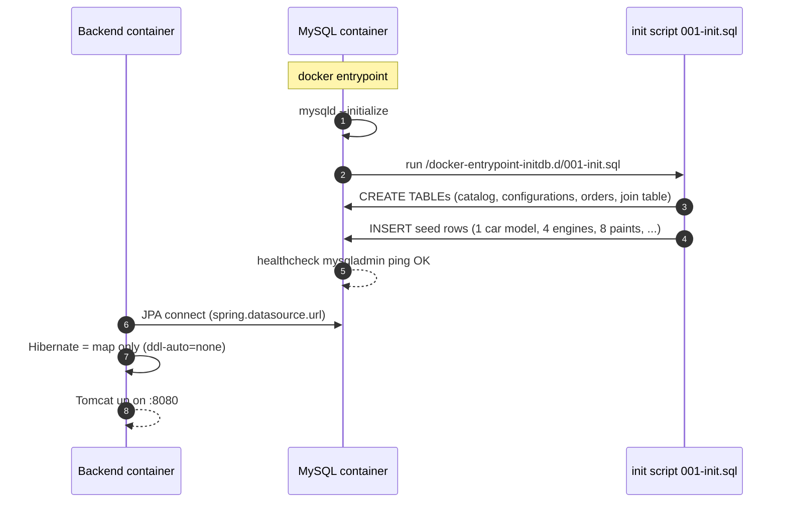

# 6. Runtime View

This section shows the important runtime scenarios. Each scenario maps
to one of the quality goals or to a core business flow.

## 6.1 Scenario 1 – Opening the configurator

Covers: first visit, Quality Goal 1 (instant feedback after initial load).

Key points:

- A **single** catalog call (`/api/options`) powers the whole UI – no
  further round-trips are needed for paint/wheel/caliper selections.
- `CarPreview3D` loads the GLB and an HDR environment once; subsequent
  selections only mutate material/mesh properties.

## 6.2 Scenario 2 – User changes a property (live update)

Covers: Quality Goal 1 – price and 3D preview must update without a
network call.

Notes:

- **No** backend call happens on property changes – all catalog data and
  all prices are already in the Vue reactive state.
- The 3D preview mutates `THREE.Material` color properties in place; the
  scene is not rebuilt.
- Switching wheel **design** toggles the visibility of the two rim
  meshes (`Obj_Rim_T0A` ↔ `Obj_Rim_T0B`) that ship inside the GLB.

## 6.3 Scenario 3 – Saving a configuration ("Continue to Summary")

Notes:

- The UUID is generated **server-side** and returned in the response;
  the frontend has no part in id creation, so the URL is guaranteed
  unique.
- `calculateTotalPrice` is computed on the server on save and on read –
  the client-side total is advisory and not trusted for storage.

## 6.4 Scenario 4 – Opening a shared configuration URL

The `:id` route parameter is a UUID, so the URL is shareable and
bookmarkable (PRD requirement 3).

## 6.5 Scenario 5 – Submitting an order

## 6.6 Scenario 6 – First-time container startup (init + schema)

The backend `depends_on` the database with `service_healthy` in
`docker/compose.yml`, so the init script has always completed by the
time the backend starts.
