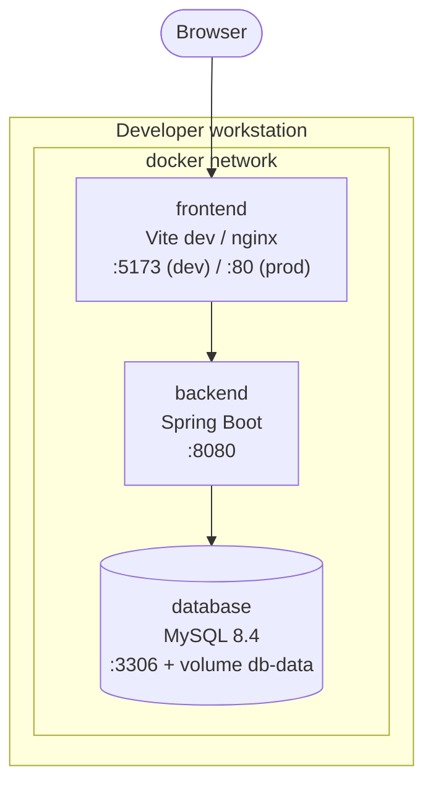
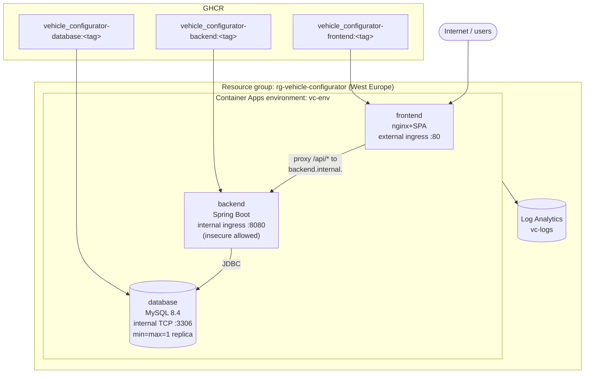
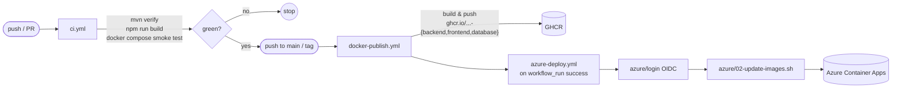

# 7. Deployment View

The system is designed to run in two environments with the same
container topology:

1. **Local developer workstation** – Docker Compose.
2. **Azure** – Azure Container Apps (production target).

## 7.1 Local Deployment (Docker Compose)

Two compose files live side-by-side in `docker/`:

- `compose.yml` – dev stack, **builds** images from local sources.
- `compose.prod.yml` – pulls the same images the cloud uses (GHCR), good
  for smoke-testing production artefacts locally.

Key details:

- **Dev frontend container** runs Vite (`npm run dev -- --host 0.0.0.0`)
  and bind-mounts the source tree (`../frontend:/app`) so hot-reload
  works out of the box; `node_modules` is kept in an anonymous volume
  so the container's install is not shadowed by the host.
- **Dev proxy** (`vite.config.js`) forwards `/api` → `http://backend:8080`
  using the docker-compose service name – cross-origin requests never
  leave the compose network.
- **Prod frontend container** is a multi-stage build ending in
  `nginx:1.27-alpine`. At container start, `envsubst` replaces
  `${BACKEND_UPSTREAM}` in a templated nginx config, so the same image
  can point to different backends (local compose, ACA FQDN, …) via a
  single env var.
- **Database** always runs with a persistent named volume `db-data` and
  a `mysqladmin ping` healthcheck; the init SQL is applied only on the
  first start (standard MySQL image behaviour).

Environment files (`docker/env/*.env`) carry the credentials. They are
identical across dev and the GHCR-backed compose stack to keep behaviour
stable.

## 7.2 Cloud Deployment (Azure Container Apps)

| Azure resource | Name / Kind | Purpose |
|----------------|-------------|---------|
| Resource group | `rg-vehicle-configurator` | Groups everything; lifecycle managed by the `azure/*.sh` scripts. |
| Log Analytics workspace | `vc-logs` | Collects stdout/stderr from all container apps. |
| Container Apps environment | `vc-env` | Shared VNET + log sink for the three container apps. |
| Container App `frontend` | external HTTP ingress :80 | nginx + SPA. Public FQDN printed by `01-setup.sh`. `BACKEND_UPSTREAM` points at `backend.internal.<env-fqdn>`. |
| Container App `backend` | internal HTTP ingress :8080 | Spring Boot. Not reachable from the internet; only the frontend can call it through the env's internal DNS. |
| Container App `database` | internal TCP ingress :3306 | Single-replica MySQL. Persistence is via the container filesystem of the running replica (see risk R-03 in section 11). |

Deployment is driven by scripts under `azure/`, sharing config in
`azure/config.env`:

| Script | Responsibility | Idempotent? |
|--------|----------------|-------------|
| `00-bootstrap-oidc.sh` | One-time: create Azure AD app `gh-vehicle-configurator-deployer`, assign Contributor on the RG scope, add a GitHub federated credential (`repo:fbrase-itk/vehicle_configurator:ref:refs/heads/main`), push `AZURE_CLIENT_ID` / `AZURE_TENANT_ID` / `AZURE_SUBSCRIPTION_ID` as repo secrets. | Yes (reuses existing AAD app). |
| `01-setup.sh` | Ensure CLI extensions and providers, create RG, Log Analytics, env, and the three container apps with the correct ingress/env vars/resources. | Yes. |
| `02-update-images.sh` | Re-read backend internal FQDN, then `az containerapp update --image …` for all three apps with a short revision suffix (`GITHUB_SHA` in CI or a timestamp locally). Also re-asserts `BACKEND_UPSTREAM` on the frontend. | Yes; forces a new revision and re-pulls `:latest`. |
| `03-teardown.sh` | Asks for confirmation (user must retype the RG name), then `az group delete --no-wait`. Leaves the AAD app and GitHub secrets intact so `01-setup.sh` can rebuild on demand. | N/A (destructive). |

## 7.3 CI/CD Pipeline

Workflows live in `.github/workflows/`:

- **`ci.yml`** – backend (`mvn verify` on Java 25), frontend
  (`npm run build` on Node 22), integration (spins up `database +
  backend` via compose and smoke-tests every `GET` + a full
  `POST /api/configurations` → `GET` → `POST /api/orders` cycle).
- **`docker-publish.yml`** – matrix build over
  `{backend, frontend, database}` with a shared GitHub Actions cache
  (`type=gha, mode=max`), pushes to GHCR with semver / sha / `latest`
  tags via `docker/metadata-action`.
- **`azure-deploy.yml`** – triggered by a successful run of
  `docker-publish.yml` on `main`, or manually. Logs into Azure via OIDC
  (no long-lived secrets), runs `azure/02-update-images.sh`, and emits
  the public frontend FQDN as a GitHub Actions notice annotation.
- **`.github/dependabot.yml`** – weekly updates for Maven, npm, Docker
  base images, and GitHub Actions.
