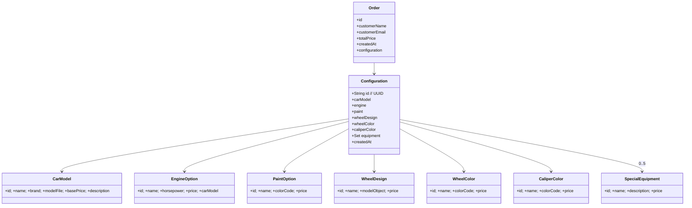

# 8. Cross-cutting Concepts

Concerns that span more than one building block are collected here.

## 8.1 Domain Model

The domain is intentionally narrow: a *configuration* is a tuple of
catalog references plus a set of equipment items, and an *order* is a
configuration with customer contact data.



Invariants (enforced in service / database):

- `EngineOption.carModel` must match `Configuration.carModel` –
  enforced in the UI by `fetchEnginesForModel(carModelId)`.
- `Configuration.equipment` is capped at **5** items by UI constraint
  (PRD); the database does not enforce this cardinality.

## 8.2 Pricing

Price is computed in one place: `ConfiguratorService.calculateTotalPrice`
on the backend. The sum is:

```
total = carModel.basePrice
      + engine.price
      + paint.price
      + wheelDesign.price
      + wheelColor.price
      + caliperColor.price
      + Σ equipment.price
```

- All prices are `DECIMAL(10,2)` in MySQL, mapped to `BigDecimal` in
  Java; no floating-point money is used server-side.
- Currency is **EUR** everywhere – formatted on the client with
  `Intl.NumberFormat('de-DE', { style: 'currency', currency: 'EUR' })`.
- The client computes the running total for responsiveness, but the
  server's computation on save/read is the authoritative value
  (persisted into `orders.total_price` at order time).

## 8.3 Persistence

- **Schema management** – DDL is in `database/init/001-init.sql` and
  applied by the MySQL entrypoint on first start. Hibernate is
  configured with `ddl-auto=none` so it only maps; it never creates,
  drops or mutates tables. Any schema evolution is done by extending
  the SQL file (or adding `002-*.sql` etc.).
- **Seeding** – the same init script inserts the catalog rows. The seed
  currently contains one car model (Aventador LP700-4), four engines,
  eight paints, two wheel designs, three wheel colors, four caliper
  colors, and five equipment items.
- **Transactions** – only `createOrder` is annotated `@Transactional`;
  everything else uses implicit per-request transactions from Spring
  Data.
- **IDs** – catalog entities use `IDENTITY`, `Order` uses `IDENTITY`,
  `Configuration.id` is a server-generated UUID string. See ADR-003.

## 8.4 3D Live Preview

`CarPreview3D.vue` is the single component responsible for the 3D view.
Key design rules:

- Scene, camera, renderer, controls and material references are stored
  in the component's `created()` hook as **non-reactive** instance
  fields (not in `data()`). Vue would otherwise wrap the three.js
  objects in proxies, which breaks `instanceof`, raycasting, and
  performance.
- The component **reuses** its scene across prop changes; only material
  properties (colors) and mesh visibility (rim T0A/T0B) are mutated.
  This keeps interactions ≤ one frame regardless of how often the user
  toggles options.
- Asset loading uses:
  - `GLTFLoader` with a `DRACOLoader` for compressed geometry,
  - `RGBELoader` for the HDR environment map used for PBR reflections.
- A `ResizeObserver` rewires the canvas size when the preview container
  changes (important on the summary card vs. the full-width header).

## 8.5 Theming

All colors and gradients are declared as CSS custom properties in the
`:root` block of `frontend/src/App.vue`. Components reference them via
`var(--token)` – no hex codes live in component stylesheets. The README
documents the raw palette, the semantic tokens derived from it, and the
gradient set (`--gradient-primary`, `--gradient-primary-on-dark`).
Retheming the application is therefore a one-file edit.

## 8.6 Cross-Origin Access (CORS)

- **Dev**: the Vite proxy forwards `/api` to the backend, so browser
  requests stay same-origin. The controller-level `@CrossOrigin(origins
  = "*")` is a belt-and-braces safety net for the rare case where a
  developer bypasses the proxy.
- **Prod**: nginx serves the SPA and reverse-proxies `/api/` to the
  internal backend; everything is same-origin from the browser's point
  of view. The `@CrossOrigin` annotation is harmless in this mode.

## 8.7 Error Handling

- Backend errors are plain Spring defaults: `404` from the controller's
  `orElse(ResponseEntity.notFound())`; `500` from `RuntimeException` in
  the service (`createOrder` on missing configuration). There is no
  custom `@ControllerAdvice` – sufficient for a prototype.
- Frontend error handling is best-effort: `services/api.js` returns
  `null` on non-2xx `GET`s, and the pages fall back to a neutral empty
  state.

## 8.8 Logging and Observability

- Backend uses Spring Boot's default logback pattern to stdout.
- Locally, `docker compose logs -f backend` is the primary window.
- In Azure, all container stdout is ingested by the Log Analytics
  workspace `vc-logs` attached to the Container Apps environment.
- No metrics export, tracing, or APM – out of scope for the prototype
  (see risk R-06).

## 8.9 Configuration and Secrets

- Backend reads datasource URL/user/password from environment variables
  (`SPRING_DATASOURCE_*`) via `application.properties` placeholders.
- In compose, these come from `docker/env/backend.env`.
- In Azure, the setup script creates **ACA secrets** for the MySQL
  passwords and wires them into each container app's environment.
- CI/CD uses **OIDC federation** (not long-lived service principal
  secrets) for `azure/login`; the only GitHub secrets are the client,
  tenant and subscription IDs written by `00-bootstrap-oidc.sh`.

## 8.10 Development Setup

- **One-command bootstrap**: `cd docker && docker compose up --build`.
- Frontend hot-reload works via Vite + bind mount.
- Backend changes require a rebuild (`docker compose up --build backend`).
- Integration smoke tests identical to the `ci.yml` integration job can
  be run locally by following the curl sequence documented in that
  workflow.
