# 10. Quality Requirements

## 10.1 Quality Tree

```mermaid
flowchart TB
    root[Quality]
    root --> usability[Usability]
    root --> deploy[Deployability / Portability]
    root --> evolv[Evolvability / Maintainability]
    root --> perf[Performance]
    root --> sec[Security]
    root --> rel[Reliability]
    root --> obs[Observability]

    usability --> u1[Live visual feedback]
    usability --> u2[Running total updates inline]
    usability --> u3[Shareable URL]

    deploy --> d1[One-command local stack]
    deploy --> d2[One-command cloud setup]
    deploy --> d3[Disposable env: teardown]

    evolv --> e1[Single design-token block]
    evolv --> e2[New option category = entity + repo + step]
    evolv --> e3[Schema in SQL, reviewable]

    perf --> p1[< 200 ms option change]
    perf --> p2[Single catalog round-trip]

    sec --> s1[No direct backend exposure in prod]
    sec --> s2[OIDC, no stored cloud secrets]

    rel --> r1[DB healthcheck gates backend start]
    rel --> r2[Transactional order creation]

    obs --> o1[stdout -> Log Analytics]
```

## 10.2 Quality Scenarios

Each scenario follows the **stimulus / environment / response / measure**
pattern.

| # | Quality | Scenario |
|---|---------|----------|
| Q-1 | Usability / Performance | A user clicks a paint swatch during normal operation. The 3D preview's body material color updates and the total price label re-renders within **200 ms**, measured in the browser's performance timeline. |
| Q-2 | Usability | A user copies the URL from the summary page and pastes it into a new browser on another machine. Within **one HTTP round-trip** (`GET /api/configurations/<uuid>`), the exact same configuration is displayed, including the 3D preview. |
| Q-3 | Deployability | A developer with Docker installed clones the repo and runs `docker compose up --build` in `docker/`. The application is reachable on `http://localhost:5173` with a working backend and a seeded database in **under 3 minutes** on a modern laptop (cold build). |
| Q-4 | Deployability | An operator runs `azure/00-bootstrap-oidc.sh` once, then `azure/01-setup.sh`. Within **~10 minutes**, the frontend is reachable on its Azure FQDN; running the same script again results in **no changes** (idempotent). |
| Q-5 | Evolvability | Adding a new option category (e.g. "interior trim") requires: 1 new table in `001-init.sql`, 1 entity, 1 repository, 1 reference from `Configuration`, 1 step section in `Configurator.vue`, and extending `ConfiguratorService.getAllOptions()`. No breaking change to `ConfigurationRequest` consumers. |
| Q-6 | Evolvability | Re-theming to a different brand palette is a one-file edit: only `:root` in `frontend/src/App.vue` needs to change; no component stylesheet is touched. |
| Q-7 | Performance | First meaningful paint of the configurator loads the car model, the HDR environment, and the full option catalog in **one** HTTP call each (`GET /api/options`, `GET /models/aventador.glb`, HDR). |
| Q-8 | Security | The backend container has **no public ingress** in production; a direct `curl` against the backend FQDN from the internet is rejected at the ACA ingress. The only externally reachable component is the frontend. |
| Q-9 | Security | The GitHub repo contains **no Azure credentials**. Only client / tenant / subscription IDs (non-secret identifiers) are stored; access is via OIDC federation scoped to `refs/heads/main`. |
| Q-10 | Reliability | The backend container starts only after MySQL reports healthy (compose `depends_on: service_healthy`). On a cold `compose up`, the first request to `/api/options` succeeds without retries from the client. |
| Q-11 | Reliability | `POST /api/orders` is `@Transactional`; if the insert into `orders` fails, no partial state is left behind, and the previous configuration is untouched. |
| Q-12 | Observability | Every backend log line is visible in the ACA environment's Log Analytics workspace within **60 seconds**, and a failed request surfaces at least the Spring stack trace. |
| Q-13 | Maintainability | `ci.yml` fails if `mvn verify`, `npm run build`, or the integration smoke test fails – no green merge to `main` without these. |

## 10.3 Non-Goals

These are intentionally *not* quality requirements for the prototype:

- High availability / multi-region.
- Formal throughput or load SLA.
- Production-grade backup & restore.
- PCI / GDPR / accessibility (WCAG) compliance audits.
- Sub-100 ms API response times under concurrent load.
